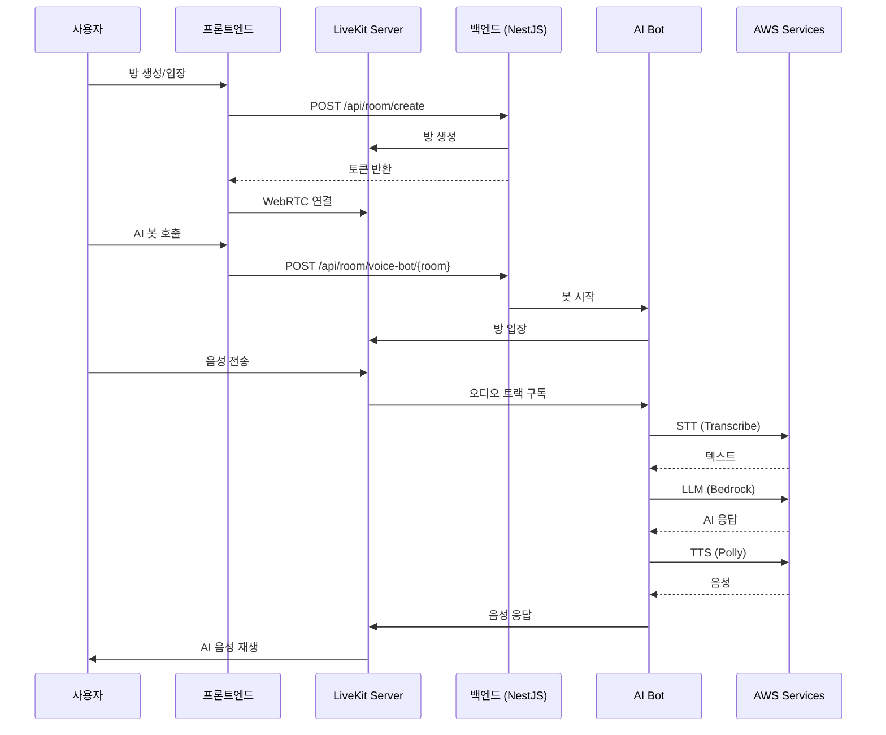

# 시스템 아키텍처

## 전체 흐름



## 모듈 구조

```
┌─────────────────────────────────────────────────────────┐
│                      AppModule                          │
├─────────────────────────────────────────────────────────┤
│  ┌─────────────┐  ┌─────────────┐  ┌─────────────┐      │
│  │ LivekitModule│  │  SttModule  │  │  LlmModule  │      │
│  ├─────────────┤  ├─────────────┤  ├─────────────┤      │
│  │ Controllers │  │ SttService  │  │ LlmService  │      │
│  │ LivekitSvc  │  │ (Transcribe)│  │ (Bedrock)   │      │
│  │ VoiceBotSvc │  └─────────────┘  └─────────────┘      │
│  └─────────────┘                                        │
│                    ┌─────────────┐                      │
│                    │  TtsModule  │                      │
│                    ├─────────────┤                      │
│                    │ TtsService  │                      │
│                    │ (Polly)     │                      │
│                    └─────────────┘                      │
└─────────────────────────────────────────────────────────┘
```

## 기술 스택

| 분류 | 기술 |
|------|------|
| 프레임워크 | NestJS |
| WebRTC | LiveKit |
| STT | AWS Transcribe Streaming |
| LLM | AWS Bedrock (Claude 3 Haiku) |
| TTS | AWS Polly (Neural - Seoyeon) |
| 컨테이너 | Docker Compose |

## AWS 서비스 연동

### AWS Transcribe Streaming
- 실시간 스트리밍 전사
- 한국어 (ko-KR) 지원
- 16kHz PCM 모노 입력

### AWS Bedrock
- Claude 3 Haiku 모델
- 빠른 응답 시간 (~2초)
- 최대 1000 토큰

### AWS Polly
- Neural 엔진 (고품질)
- Seoyeon 음성 (한국어 여성)
- MP3 출력

## LiveKit 오디오 처리

```typescript
// AudioStream이 자동으로 16kHz 모노 PCM으로 변환
const audioStream = new AudioStream(track, 16000, 1);
//                                      ^^^^^ 샘플레이트
//                                            ^ 채널 (모노)
```

- LiveKit은 원본 오디오 포맷에 상관없이 지정한 포맷으로 리샘플링
- AWS Transcribe 요구사항(16kHz PCM)에 맞춰 자동 변환
