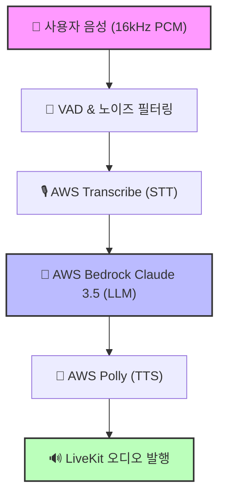

# 🤖 AI Voice Bot: 실시간 음성 상호작용 가이드

AURA의 핵심인 실시간 음성 봇의 동작 매커니즘과 구현 상세를 설명합니다. 이 시스템은 **사용자 중심의 자연스러운 대화 환경**을 제공하기 위해 설계되었습니다.

---

## ⚡ 실시간 음성 파이프라인 (Audio Pipeline)

AI 봇은 소리를 듣는 것부터 말하는 것까지 모든 과정을 **저지연(Low-Latency)** 스트림으로 처리합니다.

### 데이터 흐름


> [!TIP]
> **성능 지표:** 전체 파이프라인의 평균 응답 시간은 **약 1.2~1.5초**입니다. 이는 실제 대화의 흐름을 방해하지 않는 수준의 성능입니다.

---

## 🚀 주요 기능 및 구현 상세

### 1. 🖐️ Barge-in (끼어들기)
AI가 말하고 있을 때 사용자가 말을 하면, AI는 **즉시 발화를 중단**하고 사용자의 목소리에 집중합니다.

> [!IMPORTANT]
> **핵심 로직:** 사용자의 음성 프레임이 일정 횟수(`MIN_VOICE_FRAMES`) 이상 연속으로 감지되면 중단 플래그(`shouldInterrupt`)를 즉시 활성화합니다.

#### 📄 Code snippet: `voice-bot.service.ts`
```typescript
// handleAudioTrack 메서드: 사용자의 목소리 감지
if (isVoice) {
    voiceCount++;
    if (context.isPublishing && voiceCount >= MIN_VOICE_FRAMES) {
        this.logger.log(`[Barge-in] 사용자 끼어들기 감지! AI 발화 중단`);
        context.shouldInterrupt = true; // 중단 트리거!
    }
}

// publishAudio 메서드: AI 발화 중 플래그 체크
while (offset < pcmBuffer.length) {
    if (context?.shouldInterrupt) {
        this.logger.log(`[오디오 발행 중단] Barge-in으로 인해 즉시 멈춤`);
        context.shouldInterrupt = false; 
        break; // 루프 탈출 및 발행 중단
    }
}
```

---

### 2. 🧹 지능형 노이즈 필터링 (VAD)
주변 소음이나 "어..", "음.."과 같은 짧은 추임새로 인해 AI가 오동작하는 것을 방지합니다.

- **진폭 필터:** 평균 진폭(`VOICE_AMPLITUDE_THRESHOLD`) 500 미만 무시
- **길이 필터:** 텍스트가 5글자 미만인 경우 응답 생성 생략
- **침묵 감지:** 0.5초(`SILENCE_THRESHOLD`) 이상의 침묵 시에만 문장 종료로 판단

---

### 3. 🛡️ 요청 큐잉 및 데드락 방지
멀티스레드 환경에서 발생할 수 있는 경쟁 조건(Race Condition)을 원천 차단합니다.

#### 🔄 최신 요청 우선 처리 (Request ID)
사용자가 연달아 말을 할 경우, 가장 마지막에 발생한 `requestId`만 각 단계(STT/LLM/TTS)를 통과할 수 있습니다.

```typescript
const requestId = Date.now();
context.currentRequestId = requestId;

// STT 단계 이후 검증
if (context.currentRequestId !== requestId) {
    this.logger.log(`[취소됨] 더 최신 요청이 들어옴 (STT 후)`);
    return;
}
```

#### 🔒 안전한 상태 리셋 (Deadlock Prevention)
`finally` 블록에서 **자신의 요청 ID가 여전히 최신인 경우**에만 `isPublishing` 상태를 해제합니다.

```typescript
try {
    context.isPublishing = true;
    // ... 파이프라인 실행 ...
} finally {
    if (context.currentRequestId === requestId) {
        context.isPublishing = false; // 안전하게 잠금 해제
    }
}
```

---

## ⚙️ 시스템 설정 (System Config)

| 컴포넌트 | 설정 항목     |    값    | 설명                             |
| :------: | :------------ | :------: | :------------------------------- |
| **STT**  | Sample Rate   | 16,000Hz | 고주파수 노이즈 제거 및 효율성   |
| **LLM**  | Max Tokens    |   600    | 응답 속도 최적화를 위한 제한     |
| **TTS**  | Voice ID      | Seoyeon  | 가장 자연스러운 한국어 여성 음성 |
| **VAD**  | Silence Limit |  500ms   | 자연스러운 대화 턴 넘김 시간     |

---

## 📖 모니터링 가이드

> [!NOTE]
> 서버 로그에서 아래 키워드를 검색하여 봇의 상태를 실시간으로 확인할 수 있습니다.

- `[Barge-in]`: 사용자가 AI의 말을 끊었을 때 발생
- `[취소됨]`: 새로운 요청이 들어와 이전 작업이 무효화됨
- `[스킵] 짧은 추임새`: 필터링 로직이 정상 작동 중임을 의미
- `[LLM 재시도]`: AWS API 할당량 초과 시 자동 복구 중

---

> [!WARNING]
> **AWS 할당량 주의:** 현재 Claude 3.5 Haiku 모델의 분당 요청 제한이 엄격하므로, 짧은 시간 내 수십 번의 요청은 일시적인 에러를 유발할 수 있습니다. (재시도 로직으로 완화됨)
